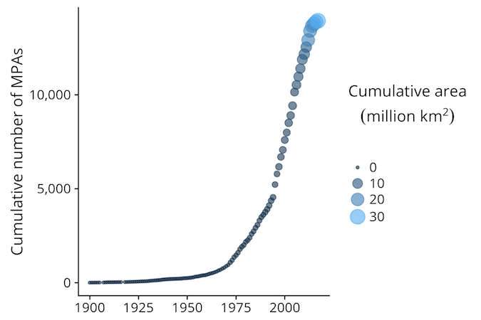
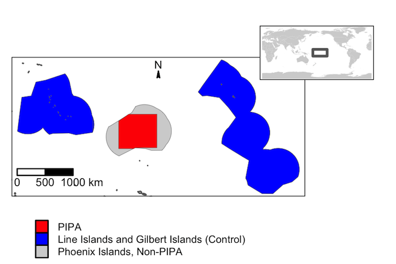
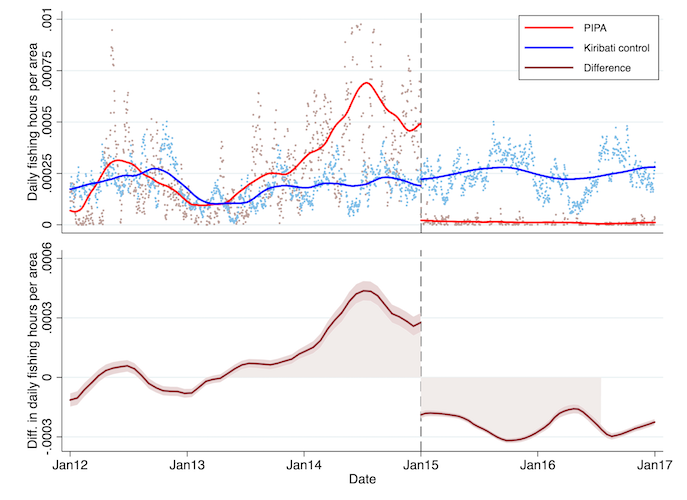
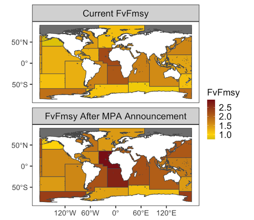

```{r setup, include=FALSE}
knitr::opts_chunk$set(echo = FALSE)

```

# Do MPA announcements trigger increased preemptive fishing?

## MPAs are getting bigger and more numerous


## Policy announcements often trigger unintended preemptive behavior

- Threat of reduced carbon consumption -> Preemptive rapid extraction of fossil fuels  (Green Paradox, [Sinn 2012](https://books.google.com/books?hl=en&lr=&id=NnwCVOso9vgC&oi=fnd&pg=PR7&dq=green+paradox+sinn&ots=1f-Nfs_snf&sig=J-frgCLBV8G6ksKxbn3eAdC5cG0#v=onepage&q=green%20paradox%20sinn&f=false))

- Threat of land-use restrictions from Endangered Species Act -> Preemptive habitat destruction  ([Lueck and Michaels 2003](http://www.journals.uchicago.edu/doi/abs/10.1086/344670), [List et al. 2006](http://www.nber.org/papers/w12777))

- Threat of gun control legislation -> Increased gun sales (and consequently accidental deths) ([Levine and McKnight 2017](http://science.sciencemag.org/content/358/6368/1324.full))

- Is there also a "Blue Paradox"? Does threat of MPA designation -> Increased preemptive fishing?

## Phoenix Islands Protected Area (PIPA)


## Blue Paradox observed for first time


## Potential global significance
Percentage of fisheries experiencing overfishing goes from 65% to 71%


# Which EEZs contribute most to conservation and why?

## Global analysis of fishing along EEZ lines
https://sfg-ucsb.shinyapps.io/gfw-eezs/

# What are global patterns and trends of human rights violations in fisheries?

## Thai fishing vessels and human trafficking


# Thanks!