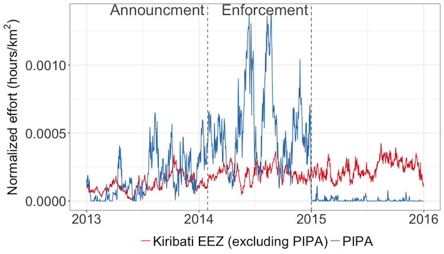
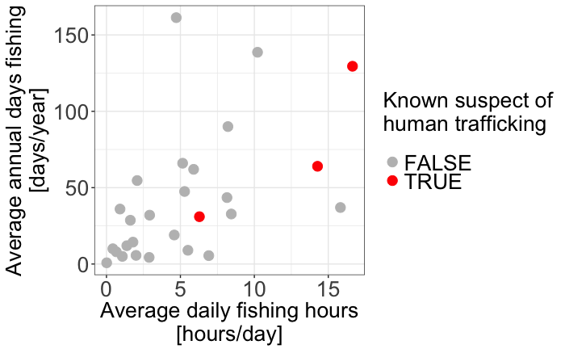

```{r setup, include=FALSE}
knitr::opts_chunk$set(echo = FALSE)

```

# Do MPA announcements trigger increased preemptive fishing?

## Trends in new MPA creation


## Fishing effort in PIPA and surrounding EEZ


# Which EEZs contribute most to conservation and why?

## Global analysis of fishing along EEZ lines
https://sfg-ucsb.shinyapps.io/gfw-eezs/

# What are global patterns and trends of human rights violations in fisheries?

## Thai fishing vessels and human trafficking


# Thanks!